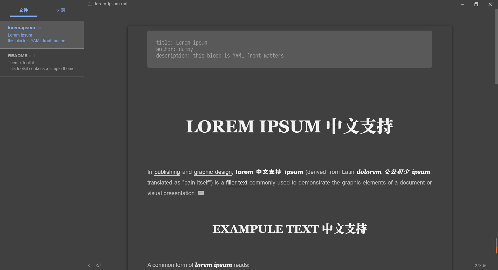
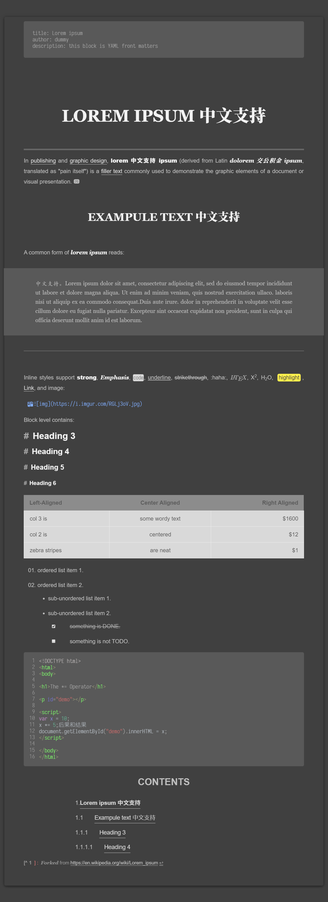

# typora-theme-autumnus_dark

根据 night 主题和 han.css 改动的 Typora 主题。

建议安装的字体：思源黑体、思源宋体、更纱黑体（term sc），苍耳今楷05。

请不要试图在导出 HTML 后，在将其打印为 PDF，目前还没有进行PDF 导出格式的优化。

`更新日志`：

2020-09-03—— `UPDATE`  

+ 新增可选暗夜主题 `Opt-dark` 【[主题预览](Review/opt-review.png)】（Typora 0.9.95版新增了根据系统色彩选择 主题颜色的选项，可以设定在系统暗夜模式下，自动替换为暗夜主题。）

  

2020-08-15—— `UPDATE`  

+ 更新了缺省字体中的楷体。
+ 调整了部分元素颜色、间距。
+ 增加了目录自动编码，默认只显示到四级标题。（将代码 `.md-toc-h5,.md-toc-h6 {display: none;}` 注释掉即可）。
+ 增加了大纲目录自动编码。
+ 三到六级标题的区分更加明显。
+ 调整了图片的样式。

2020-08-13 —— `UPDATE`  

+ 添加了更多的缺省字体，参考 `font.css`。
+ 修改了引用的显示样式和打印样式。
+ 修改了 UI 界面部分的颜色配合问题。
+ 修改了表格样式，使之更加明显。
+ 修复了部分显示错误。
+ 调整了表格的显示问题。

`已知问题`：

- [x] 在引用中，光标显示会滞后一格（删除了引用首字下沉导致的光标异常）。

`待完成部分`：

- [ ] 目录样式优化。
- [x] 黑夜模式（已创建，[typora-theme-autumnus_dark](https://github.com/Soanguy/typora-theme-autumnus_dark)）

样式预览：

